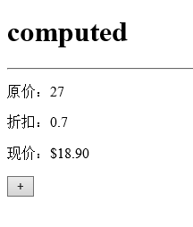

# computed

## 演示效果

使用已有参数，计算出新的参数，并且显示到页面上，计算出来的数值保留2位数；

 


## 实现

```html
    <div id="app">
        <p> 原价：{{orgPrice}}</p>
        <p> 折扣：{{discount}}</p>
        <p> 现价：{{price}}</p>
        <p>
            <button @click="add">+</button>
        </p>
    </div>
    <script>
        var vm = new Vue({
            el: '#app',
            data: {
                orgPrice: 10,
                discount: 0.7
            },
            computed: {
                price: function () {
                    var num = new Number(this.orgPrice * this.discount)
                    return '$' + num.toFixed(2);
                }
            },
            methods: {
                add: function () {
                    this.orgPrice++;
                }
            }
        })
    </script>
```
 
 ## [完整代码](computed.html)

