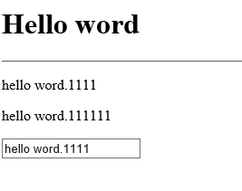

 # Hello word

 ## 效果

引用vue，input输入框输入的数据同步到p标签中。


 
 ## 实现
 ```html
<script src="../assets/js/vue.js"></script>

<div id="app">
    <p> {{message}}</p>
    <p> {{message+11}}</p>      
    <p><input type="text" v-model="message"></p>
</div>
<script>
    var vm = new Vue({
        el:'#app',
           data:{
               message: 'hello word.'
        }
    })    
</script>
 ```
 
 ## [完整代码](helloWord.html)
