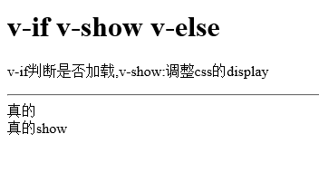

# v-if

## 演示效果

* v-if  
* v-show 
* v-else 

 v-if判断是否加载,v-show:调整css的display

 

 
 ## 实现
 ```html
    <div id="app">
        <div v-if="ok">真的</div>
        <div v-else>假的</div>
        <div v-show="ok">真的show</div>
    </div>
    <script>
        var vm = new Vue({
            el:'#app',
            data:{
                ok: true
            }
        })    
    </script>
 ```
 
 ## [完整代码](v-if.html)
