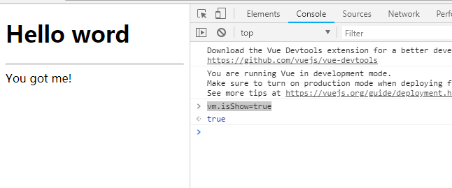

 # v-show

 ## 效果

引用vue，通过一个变量控制元素显示或者隐藏，在控制台中输入``vm.isShow=true`` 或者``vm.isShow=false``可以控制元素的显示和隐藏。



 
 ## 实现
 ```html
    <div id="app">
        <div v-show="isShow">You got me!</div>
    </div>
    <script>
        var vm = new Vue({
            el:'#app',
            data:{
                isShow: false,
            }
        })    
    </script>
 ```
 
 ## [完整代码](v-show.html)
